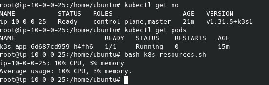

**AWS Anywhere:** 

**Use Cases:**.
- Low-latency applications
- _Data residency requirements_
- _Local data processing_
- Migration and modernization

**Environments:**
- On-premises
- more

---
**Amazon ECS (Elastic Container Service):**

**ECS Anywhere:** Running ECS on your own infrastructure.

**Use cases:**
 - Modernize applications
 - Deploy data processing workloads at the edge
 
---
**Amazon EKS (Elastic Kubernetes Service):**

**EKS Anywhere:** 
    
    **EKS Distro:** The Kubernetes distribution used by EKS Anywhere.
    **EKS Connector:** Viewing EKS Anywhere clusters in the Amazon EKS console.

**Use Cases:**
  - Deploy across hybrid environments.
  - Deploy high-performing large language models (LLMs).
  - Maintain data sovereignty.

---

## Tooling

---

## Resources

[1] https://aws.amazon.com/ecs/anywhere/
[2] https://aws.amazon.com/aws-wherever-you-need-it/
[3] https://aws.amazon.com/eks/eks-anywhere/?pg=ln&sec=uc
[4] https://docs.aws.amazon.com/de_de/rolesanywhere/latest/userguide/introduction.html
[5] https://docs.aws.amazon.com/rolesanywhere/latest/APIReference/Welcome.html
[6] https://anywhere.eks.amazonaws.com/docs/overview/
[7] https://anywhere.eks.amazonaws.com/docs/clustermgmt/cluster-overview/
[8] https://docs.aws.amazon.com/AmazonECS/latest/developerguide/ecs-anywhere.html